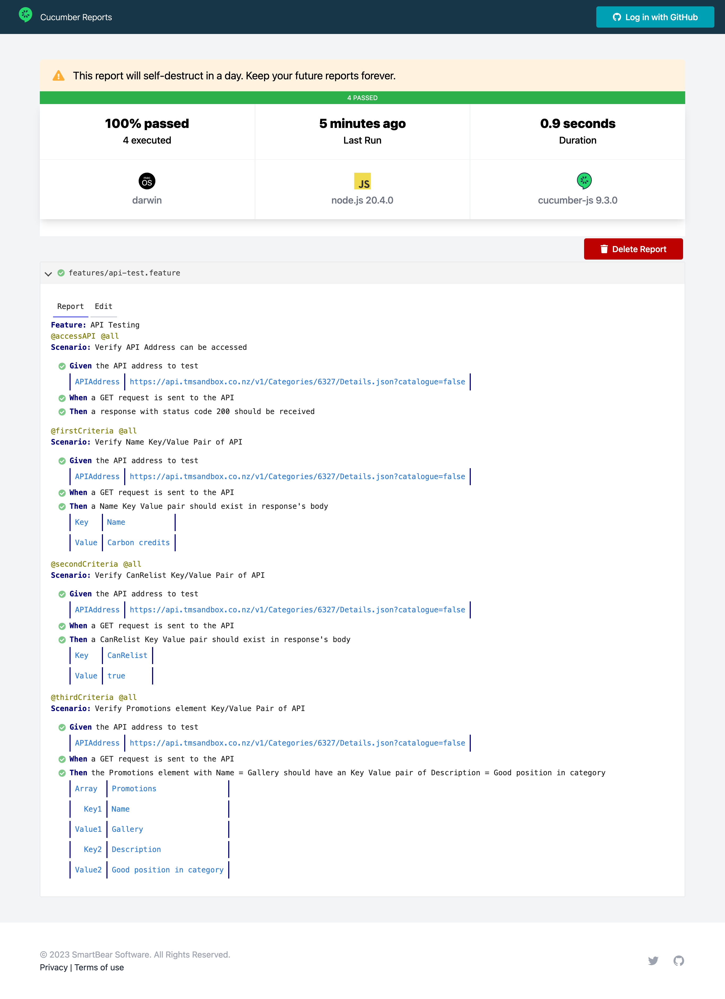

# Assurity-APIAutomation
 Automated Test for API Testing [Assurity Consulting Technical Assessment]

# Cloning the Repository
We have multiple options in order to clone the repository into our local machines. 
1. Downloading the project files and opening it in any IDE of your choice.
2. Cloning via Git.

## 1. Downloading the project files and opening it in any IDE of your choice.
1. Navigate to the [Assurity-APIAutomation repository](https://github.com/perochowa-tsm/Assurity-APIAutomation).
2. Click on the **Code** button.

3. Then click on **Download ZIP**.
3. Unzip the package and open the folder using any IDE of your choice.

## 2. Cloning via Git.
1. Check if your device already has Git via this command.
```
git --version
```
2. If your device does not have git installed, please refer to this [git installation document](https://git-scm.com/book/en/v2/Getting-Started-Installing-Git).
3. Once git is installed, navigate to the [Assurity-APIAutomation repository](https://github.com/perochowa-tsm/Assurity-APIAutomation).
2. Click on the **Code** button then click on the copy button beside the URL.

3. Open the IDE of your choice and then enter the git clone command. 
```
git clone https://github.com/perochowa-tsm/Assurity-APIAutomation.git
```

# Installation
Note: If your device does not have Node.js and npm install, you can install these via accessing these links. 
[Node.js](https://nodejs.org/en/download)
[npm](https://docs.npmjs.com/downloading-and-installing-node-js-and-npm)

Once the repository has been successfully cloned, navigate into the package directory using the command below. 
```
cd Assurity-APIAutomation
```
Then we can now install the necessary dependencies with the command below. 
```
npm i
```


# Running tests
Open a terminal and navigate to the root directory of the project (../Assurity-APIAutomation). 

To run all tests in the features/api-test.feature file, you may use this command. 
```
npx cucumber-js --tags=@all --publish

OR SIMPLY

npm run testAll
```

To run only a specific test, you may use the command below and replace the tag arguement with the test you want to run. 

```
npx cucumber-js --tags=@accessAPI --publish

OR

npx cucumber-js --tags=@firstCriteria --publish

OR

npx cucumber-js --tags=@secondCriteria --publish

OR

npx cucumber-js --tags=@thirdCriteria --publish
```

# Reporting
There will be a report generated at the terminal where you ran the tests. Moreover, the built in Cucumber report can be accessed at the link provided at the end of each run. (i.e. "https://reports.cucumber.io/reports/...")


The report looks like this. 


Note: If you have any questions or encounter any problems, you may contact me at perochowa@gmail.com. Hopefully, there won't be any but feel free to message me anytime. Thank you! 